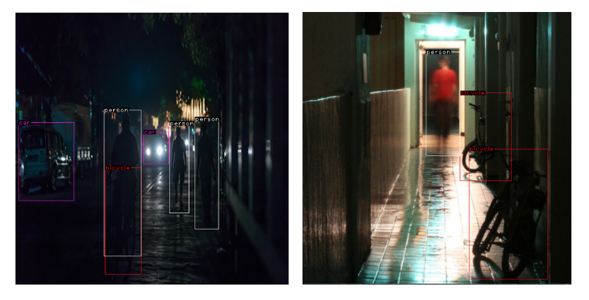

# Low-light object detection

System for comparison, training and evaluation methods for low-light object detection.

## Overview
This project implements object detection models trained on the [ExDark dataset](https://github.com/cs-chan/Exclusively-Dark-Image-Dataset) for detecting objects in low-light environments. It compares them models inferred or trained on LLIE (Low-light images enhancements) improved images.

## Features
- Fine-tuning of various object detectors on ExDark:
  - Faster R-CNN 
  - RetinaNet
  - FCOS
  - DETR and Deformable DETR
- Data augmentation including gamma brightening or image enhancement by external LLIE model

## Tech stack
- Object detection models from torchvison and transformers
- Training with PyTorch Lightning
- Experiment tracking with Weights & Biases
- Configurable training using Hydra

## Installation
1. Install dependencies using PDM `pdm install` or `pip install .`
2. Set up data via `make setup-data`

## Running experiments
Run `python exdark/modeling/train.py <experiment=fcos_exp>` - choose any configuration file or directly as CLI
argument override some properties like `model=retinanet model.lr_head=0.02`

`scripts` directory contains bash scripts with conducted experiments 