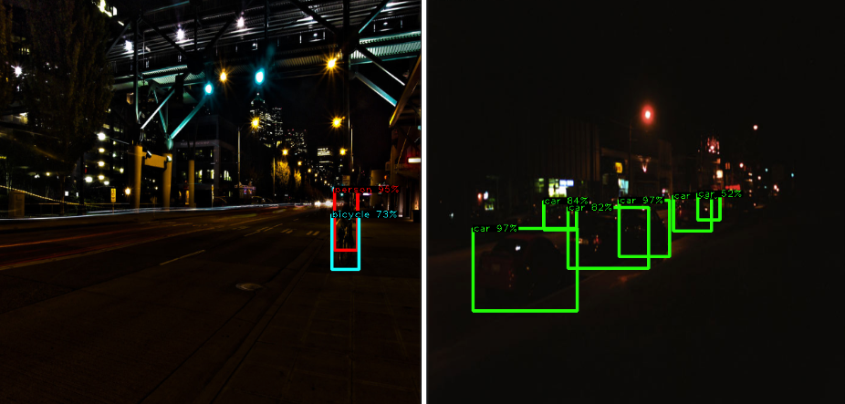

# Low-light object detection



## Table of Contents
1. [Overview](#overview)
2. [User guide and contribution](#user-guide-and-contribution)
  - [Project structure](#project-structure)
  - [Installation](#installation)
  - [Details about configuration](#details-about-configuration)
  - [Running experiments](#running-experiments)
    - [Single run](#single-run)
    - [Batch run](#batch-run)
  - [Inference](#inference)
  - [Contribution](#contribution)

## Overview

Benchmark for objectively comparing
object detection methods under low-light conditions across various object detection
deep learning architectures, focusing on application of low-light image enhancement
techniques and fine-tuning.


This project implements object detection models trained on the [ExDark dataset](https://github.com/cs-chan/Exclusively-Dark-Image-Dataset) for detecting objects in low-light environments. It compares them models inferred or trained on LLIE (Low-light images enhancements) improved images.

### Methods
Baseline
- adapter for detection model trained on MS COCO: mapping MS COCO to ExDark categories
<br /><br />

Low-light image enhancement (LLIE) methods applied as preprocessing for baseline model:
- gamma correction
- HVI-CIDNet - Sota of LOLv2
<br /><br />

Fine-tuning various object detectors on ExDark (with and without LLIE):
  - Faster R-CNN 
  - RetinaNet
  - FCOS
  - Deformable DETR

### Scores
| Method | Faster R-CNN |  | FCOS |  | RetinaNet |  | Def. DETR |  |
|--------|--------------|--------------|--------|--------|------------|------------|------------|------------|
|  | mAP | mAP@50 | mAP | mAP@50 | mAP | mAP@50 | mAP | mAP@50 |
| Raw - baseline | 32.4 | 62.0 | 26.4 | 52.0 | 28.0 | 55.1 | 20.1 | 36.9 |
| Raw - fine-tuned | 43.0 | 72.0 | 40.9 | 67.9 | 36.4 | 62.3 | 30.7 | 49.5 |
| Gamma - baseline | 29.6 | 56.8 | 25.2 | 50.1 | 27.5 | 53.9 | 18.4 | 33.8 |
| Gamma - fine-tuned | 45.6 | 74.5 | 36.7 | 60.3 | 24.0 | 41.2 | n/a | n/a |
| HVI-CID - baseline | 29.9 | 58.64 | 25.3 | 49.4 | 26.6 | 52.3 | 17.9 | 33.8 |
| HVI-CID - fine-tuned | 43.5 | 72.5 | 35.6 | 59.3 | 8.1 | 14.9 | n/a | n/a |


## User guide and contribution
### Project structure
- `configs/`: Configuration files for models, datasets, and experiments
- `data/`: Source images and annotation files
- `exdark/`: Main package containing:
  - `data/`: Data preprocessing and handling modules
  - `modeling/`: Training and evaluation scripts
  - `models/`: Object detection model architectures
- `tests/`: Unit tests
- `external/`: External code and Git submodules

### Installation
Python 3.10 or higher is required.
1. Install dependencies using [PDM](https://pdm-project.org/en/latest/) `pdm install` or `pip install .`
2. Set up data via `make data-setup`
3. If you want to use W&B logger, create `.env` file similar to `.env_example`
and insert your token; then run `set -a && source .env && set +a` (add flag `logger=csv` to use offline csv logger instead of W&B)

### Details about configuration
Configuration is powered by [Hydra](https://hydra.cc/docs/intro/). For more details, check the sections on [running experiments](#running-experiments) and [inference](#inference). For more information, visit the [Hydra documentation](https://hydra.cc/docs/intro/).
The [`configs`](configs ) directory contains various configuration files that define the settings for models, datasets, experiments, and other components. Here is the structure of the [`configs`](configs ) directory:
```shell
configs
├── /datamodule
├── /experiment
├── /logger
├── /model
├── /trainer
├── train.yaml
├── eval.yaml
├── inference.yaml
└── visualizedata.yaml
```

- **datamodule/**: Contains configurations for data modules, specifying paths to datasets, batch sizes, and other data-related settings.
  - [`configs/datamodule/datamodule.yaml`](configs/datamodule/datamodule.yaml ): General data module configuration.
  - [`configs/datamodule/gaussnoise.yaml`](configs/datamodule/gaussnoise.yaml ): Configuration for data module with Gaussian noise augmentation.
  - [`configs/datamodule/gamma.yaml`](configs/datamodule/gamma.yaml ): Configuration for data module with gamma correction.
  - [`configs/datamodule/hvicid.yaml`](configs/datamodule/hvicid.yaml ): Configuration for HVICID dataset.

- **model/**: Contains configurations for different models.
  - [`configs/model/def_detr.yaml`](configs/model/def_detr.yaml ): Configuration for Deformable DETR model.
  - [`configs/model/def_detr_2.yaml`](configs/model/def_detr_2.yaml ): Configuration for a variant of Deformable DETR model.
  - [`configs/model/detr.yaml`](configs/model/detr.yaml ): Configuration for DETR model.
  - [`configs/model/fasterrcnn.yaml`](configs/model/fasterrcnn.yaml ): Configuration for Faster R-CNN model.
  - [`configs/model/fcos.yaml`](configs/model/fcos.yaml ): Configuration for FCOS model.
  - [`configs/model/retinanet.yaml`](configs/model/retinanet.yaml ): Configuration for RetinaNet model.
  - [`configs/model/wrapperdefdetr.yaml`](configs/model/wrapperdefdetr.yaml ): Wrapper configuration for Deformable DETR model.
  - [`configs/model/wrapperfasterrcnn.yaml`](configs/model/wrapperfasterrcnn.yaml ): Wrapper configuration for Faster R-CNN model.
  - [`configs/model/wrapperfcos.yaml`](configs/model/wrapperfcos.yaml ): Wrapper configuration for FCOS model.
  - [`configs/model/wrapperretinanet.yaml`](configs/model/wrapperretinanet.yaml ): Wrapper configuration for RetinaNet model.

- [**experiment/**](configs/experiment): Contains configurations for different experiments, specifying which model and settings to use.
- [**logger/**](configs/logger): Contains configurations for logging - Weights & Biases / CSVlogger.
- [**trainer/**](configs/trainer): Contains configurations for the training process.
- [**eval.yaml**](configs/eval.yaml): Configuration for evaluation.
- [**inference.yaml**](configs/inference.yaml): Configuration for inference.
- [**train.yaml**](configs/train.yaml): Configuration for training.
- [**visualizedata.yaml**](configs/visualizedata.yaml): Configuration for visualizing data samples.

### Running experiments
#### Single run
Run `python exdark/modeling/train.py <experiment=fcos_exp>` - choose any configuration file or directly as CLI
argument override some properties like `model=retinanet model.lr_head=0.02`. You can override any parameter specified
in `/configs`.

#### Batch run
`/scripts/shell` directory contains bash scripts with conducted experiments - just run `bash scripts/<name_of_script.sh>

or you can use [Weights & Biases sweep](https://docs.wandb.ai/guides/sweeps/) - appropriate configuration files for
sweeps are in `/scripts/sweeps` - run
```shell
wandb sweep <path_to_config>
wandb agent <sweep_id>
```

### Inference
To run inference execute `python exdark/modeling/inference.py model=<config_name> ckpt_path=<path>` - for more options 
refer to `configs/inference.yaml`

### Contribution
`make tests` - run tests

`make lint` and `make format` - invoke linting and code formating 
